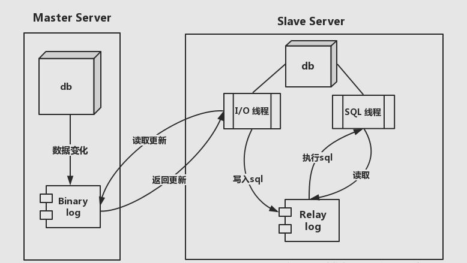

> [mysql高可用参考文档](https://developer.aliyun.com/article/776634)     https://www.cnblogs.com/kcxg/p/11130697.html

## 1.mysql 主从复制原理

1. 主从复制原理图：

2. 主主热备原理图：


## 2.初始化安装并改root密码
```bash
# 安装数据库
# 准备本地安装包
[root@slave2 mysql8]# ls
mysql-community-client-8.0.37-1.el7.x86_64.rpm          mysql-community-embedded-compat-8.0.37-1.el7.x86_64.rpm  mysql-community-server-8.0.37-1.el7.x86_64.rpm
mysql-community-client-plugins-8.0.37-1.el7.x86_64.rpm  mysql-community-icu-data-files-8.0.37-1.el7.x86_64.rpm   mysql-community-server-debug-8.0.37-1.el7.x86_64.rpm
mysql-community-common-8.0.37-1.el7.x86_64.rpm          mysql-community-libs-8.0.37-1.el7.x86_64.rpm
mysql-community-devel-8.0.37-1.el7.x86_64.rpm           mysql-community-libs-compat-8.0.37-1.el7.x86_64.rpm

# 从本地安装
[root@slave2 mysql8]# yum localinstall ./*

# 启动mysql
[root@slave2 mysql8]# systemctl start mysqld

# 查询mysql初始密码
[root@slave2 ~]# grep 'temporary password' /var/log/mysqld.log | awk '{print $NF}'
np:VItG;n4*F

# 使用初始密码登录mysql
[root@slave2 mysql8]# mysql -uroot -p
Enter password: 
Welcome to the MySQL monitor.  Commands end with ; or \g.
Your MySQL connection id is 8
Server version: 8.0.37

# 修改root密码
mysql> alter user 'root'@'localhost' identified with mysql_native_password  by '##EDC2wsx1qaz';
Query OK, 0 rows affected (0.01 sec)

```

## 3.配置mysql开启主 - 从

### 1.修改配置文件开启log-bin日志
```bash
#  master1
[root@slave2 ~]# hostname -I
192.168.10.100 172.17.0.1 
[root@slave2 ~]# hostname
slave2

# 编辑my.cnf配置文件

# For advice on how to change settings please see
# http://dev.mysql.com/doc/refman/8.0/en/server-configuration-defaults.html

[mysqld]
#
# Remove leading # and set to the amount of RAM for the most important data
# cache in MySQL. Start at 70% of total RAM for dedicated server, else 10%.
# innodb_buffer_pool_size = 128M
#
# Remove the leading "# " to disable binary logging
# Binary logging captures changes between backups and is enabled by
# default. It's default setting is log_bin=binlog
# disable_log_bin
#
# Remove leading # to set options mainly useful for reporting servers.
# The server defaults are faster for transactions and fast SELECTs.
# Adjust sizes as needed, experiment to find the optimal values.
# join_buffer_size = 128M
# sort_buffer_size = 2M
# read_rnd_buffer_size = 2M
#
# Remove leading # to revert to previous value for default_authentication_plugin,
# this will increase compatibility with older clients. For background, see:
# https://dev.mysql.com/doc/refman/8.0/en/server-system-variables.html#sysvar_default_authentication_plugin
# default-authentication-plugin=mysql_native_password

datadir=/var/lib/mysql
socket=/var/lib/mysql/mysql.sock

log-error=/var/log/mysqld.log
pid-file=/var/run/mysqld/mysqld.pid

# 配置server-id 每个MySQL实例的server-id都不能相同
server-id=1
# MySQL的日志文件的名字
log-bin=mysql_master100
# 作为从库时 更新操作是否写入日志 on：写入  其他数据库以此数据库做主库时才能进行同步
log-slave-updates=on

# MySQL系统库的数据不需要同步 我们这里写了3个  更加保险
# 同步数据时忽略一下数据库 但是必须在使用use db的情况下才会忽略；如果没有使用use db 比如create user  数据还是会同步的
replicate-ignore-db=information_schema
replicate-ignore-db=mysql
replicate-ignore-db=performance_schema
replicate-ignore-db=sys
# 使用通配符忽略MySQL系统库的表  这样在create user时也不会进行同步了
replicate_wild_ignore_table=information_schema.%
replicate_wild_ignore_table=mysql.%
replicate_wild_ignore_table=performance_schema.%
replicate_wild_ignore_table=sys.%
# MySQL系统库的日志不计入binlog 这样更加保险了
binlog-ignore-db=information_schema
binlog-ignore-db=mysql
binlog-ignore-db=performance_schema
binlog-ignore-db=sys

```

```bash
# master2中的配置只要基于master1的配置修改以下两项即可

# 配置server-id 每个MySQL实例的server-id都不能相同
server-id=2
# MySQL的日志文件的名字
log-bin=mysql_master200
```

### 2.开始配置主从复制(如果只是做主从复制，到这一步做完就完成了)
```bash
# master1上执行

[root@slave2 ~]# mysql -utooy -p##EDC2wsx1qaz
mysql: [Warning] Using a password on the command line interface can be insecure.
ERROR 1045 (28000): Access denied for user 'tooy'@'localhost' (using password: YES)
[root@slave2 ~]# mysql -uroot -p##EDC2wsx1qaz
mysql: [Warning] Using a password on the command line interface can be insecure.
Welcome to the MySQL monitor.  Commands end with ; or \g.
Your MySQL connection id is 9
Server version: 8.0.37 MySQL Community Server - GPL

Copyright (c) 2000, 2024, Oracle and/or its affiliates.

Oracle is a registered trademark of Oracle Corporation and/or its
affiliates. Other names may be trademarks of their respective
owners.

Type 'help;' or '\h' for help. Type '\c' to clear the current input statement.

mysql> 
mysql> create user 'repl_master100'@'%' identified with mysql_native_password by '##EDC2wsx1qaz';
Query OK, 0 rows affected (0.01 sec)

mysql> grant replication slave on *.* to 'repl_master100'@'%';
Query OK, 0 rows affected (0.00 sec)

mysql> flush privileges;
Query OK, 0 rows affected (0.00 sec)

mysql> show master status;
+------------------------+----------+--------------+-------------------------------------------------+-------------------+
| File                   | Position | Binlog_Do_DB | Binlog_Ignore_DB                                | Executed_Gtid_Set |
+------------------------+----------+--------------+-------------------------------------------------+-------------------+
| mysql_master100.000001 |      847 |              | information_schema,mysql,performance_schema,sys |                   |
+------------------------+----------+--------------+-------------------------------------------------+-------------------+
1 row in set (0.01 sec)

```

```bash
# master2上执行
mysql> change master to master_host='192.168.10.100',master_port=3306,master_user='repl_master100',master_password='##EDC2wsx1qaz',master_log_file='mysql_master100.000001',master_log_pos=847;
Query OK, 0 rows affected, 9 warnings (0.01 sec)

# 查询
mysql> show slave status\G;
*************************** 1. row ***************************
               Slave_IO_State: 
                  Master_Host: 192.168.10.100
                  Master_User: repl_master100
                  Master_Port: 3306
                Connect_Retry: 60
              Master_Log_File: mysql_master100.000001
          Read_Master_Log_Pos: 847
               Relay_Log_File: Test1-relay-bin.000001
                Relay_Log_Pos: 4
        Relay_Master_Log_File: mysql_master100.000001
             Slave_IO_Running: No
            Slave_SQL_Running: No

# 开启slave
mysql> start slave;
Query OK, 0 rows affected, 1 warning (0.02 sec)

# 再次查询
mysql> show slave status\G;
*************************** 1. row ***************************
               Slave_IO_State: Waiting for source to send event
                  Master_Host: 192.168.10.100
                  Master_User: repl_master100
                  Master_Port: 3306
                Connect_Retry: 60
              Master_Log_File: mysql_master100.000001
          Read_Master_Log_Pos: 847
               Relay_Log_File: Test1-relay-bin.000002
                Relay_Log_Pos: 332
        Relay_Master_Log_File: mysql_master100.000001
             Slave_IO_Running: Yes
            Slave_SQL_Running: Yes

## 出现以下两个yes表示成功
# Slave_IO_Running: Yes
# Slave_SQL_Running: Yes
```

## 4.配置mysql开启主 - 主
### 1.接下来搭建主主复制（即在3的基础上把2中的过程倒着做一遍）
```bash
# 在master2上操作
mysql> create user 'repl_master200'@'%' identified with mysql_native_password by '##EDC2wsx1qaz';
Query OK, 0 rows affected (0.01 sec)

mysql> grant replication slave on *.* to 'repl_master200'@'%';
Query OK, 0 rows affected (0.00 sec)

mysql> flush privileges;
Query OK, 0 rows affected (0.00 sec)

mysql> show master status;
+------------------------+----------+--------------+-------------------------------------------------+-------------------+
| File                   | Position | Binlog_Do_DB | Binlog_Ignore_DB                                | Executed_Gtid_Set |
+------------------------+----------+--------------+-------------------------------------------------+-------------------+
| mysql_master200.000002 |     1137 |              | information_schema,mysql,performance_schema,sys |                   |
+------------------------+----------+--------------+-------------------------------------------------+-------------------+
1 row in set (0.00 sec)
```

```bash
# 在master1上操作
mysql> change master to master_host='192.168.10.200',master_port=3306,master_user='repl_master200',master_password='##EDC2wsx1qaz',master_log_file='mysql_master200.000002',master_log_poos=1137;
Query OK, 0 rows affected, 9 warnings (0.01 sec)

mysql> show slave status\G;
*************************** 1. row ***************************
               Slave_IO_State: 
                  Master_Host: 192.168.10.200
                  Master_User: repl_master200
                  Master_Port: 3306
                Connect_Retry: 60
              Master_Log_File: mysql_master200.000002
          Read_Master_Log_Pos: 1137
               Relay_Log_File: slave2-relay-bin.000001
                Relay_Log_Pos: 4
        Relay_Master_Log_File: mysql_master200.000002
             Slave_IO_Running: No
            Slave_SQL_Running: No

mysql> start slave;
Query OK, 0 rows affected, 1 warning (0.01 sec)

mysql> show slave status\G;
*************************** 1. row ***************************
               Slave_IO_State: Waiting for source to send event
                  Master_Host: 192.168.10.200
                  Master_User: repl_master200
                  Master_Port: 3306
                Connect_Retry: 60
              Master_Log_File: mysql_master200.000002
          Read_Master_Log_Pos: 1137
               Relay_Log_File: slave2-relay-bin.000002
                Relay_Log_Pos: 332
        Relay_Master_Log_File: mysql_master200.000002
             Slave_IO_Running: Yes
            Slave_SQL_Running: Yes

```

### 结合keepalived实现高可用

> keepalived配置见：[keepalived](./keepalived.md)