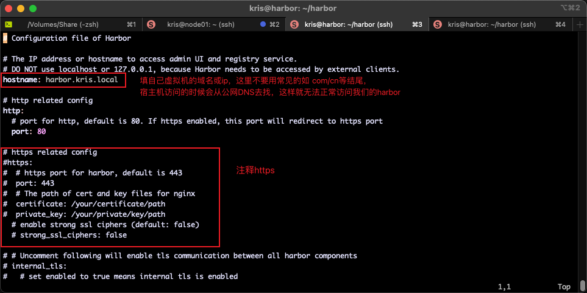

# 如何部署私有容器仓库

##  ubuntu 20.04 arm64 安装docker
### 更新软件源为阿里云
```bash

更新apt包索引：
sudo apt-get update
 安装必备的软件包以允许apt通过 HTTPS 使用存储库（repository）：
sudo apt-get install ca-certificates curl gnupg lsb-release

# 设置阿里云 apt 源
```bash
kris@harbor:/etc/apt$ sudo vim sources.list
# 在最后添加以下内容
deb https://mirrors.aliyun.com/ubuntu-ports/ focal main restricted universe multiverse
deb-src https://mirrors.aliyun.com/ubuntu-ports/ focal main restricted universe multiverse

deb https://mirrors.aliyun.com/ubuntu-ports/ focal-security main restricted universe multiverse
deb-src https://mirrors.aliyun.com/ubuntu-ports/ focal-security main restricted universe multiverse

deb https://mirrors.aliyun.com/ubuntu-ports/ focal-updates main restricted universe multiverse
deb-src https://mirrors.aliyun.com/ubuntu-ports/ focal-updates main restricted universe multiverse

# deb https://mirrors.aliyun.com/ubuntu-ports/ focal-proposed main restricted universe multiverse
# deb-src https://mirrors.aliyun.com/ubuntu-ports/ focal-proposed main restricted universe multiverse

deb https://mirrors.aliyun.com/ubuntu-ports/ focal-backports main restricted universe multiverse
deb-src https://mirrors.aliyun.com/ubuntu-ports/ focal-backports main restricted universe multiverse
```


### 安装docker
```bash
# ===========================
# step 1: 安装必要的一些系统工具
sudo apt-get update
sudo apt-get install ca-certificates curl gnupg

# step 2: 信任 Docker 的 GPG 公钥
sudo install -m 0755 -d /etc/apt/keyrings
sudo curl -fsSL https://mirrors.aliyun.com/docker-ce/linux/ubuntu/gpg | sudo gpg --dearmor -o /etc/apt/keyrings/docker.gpg
sudo chmod a+r /etc/apt/keyrings/docker.gpg

# Step 3: 写入软件源信息
echo \
  "deb [arch=$(dpkg --print-architecture) signed-by=/etc/apt/keyrings/docker.gpg] https://mirrors.aliyun.com/docker-ce/linux/ubuntu \
  "$(. /etc/os-release && echo "$VERSION_CODENAME")" stable" | \
sudo tee /etc/apt/sources.list.d/docker.list > /dev/null
 
# Step 4: 安装Docker
sudo apt-get update
sudo apt-get install docker-ce docker-ce-cli containerd.io docker-buildx-plugin docker-compose-plugin -y
# =====================


# 安装指定版本的Docker-CE:
# Step 1: 查找Docker-CE的版本:
# apt-cache madison docker-ce
#   docker-ce | 17.03.1~ce-0~ubuntu-xenial | https://mirrors.aliyun.com/docker-ce/linux/ubuntu xenial/stable amd64 Packages
#   docker-ce | 17.03.0~ce-0~ubuntu-xenial | https://mirrors.aliyun.com/docker-ce/linux/ubuntu xenial/stable amd64 Packages
# Step 2: 安装指定版本的Docker-CE: (VERSION例如上面的17.03.1~ce-0~ubuntu-xenial)
# sudo apt-get -y install docker-ce=[VERSION]
```
> reference: [https://developer.aliyun.com/mirror/?serviceType=&tag=&keyword=docker](https://developer.aliyun.com/mirror/?serviceType=&tag=&keyword=docker)

```bash
# 1. 安装 Docker 后，创建 docker 组（如果不存在）
sudo groupadd docker

# 2. 将用户加入 docker 组
sudo usermod -aG docker kris

# 3. 重新登录或重启 shell
newgrp docker

#  检查 docker 版本查看是否成功安装
kris@harbor:/etc/apt/keyrings$ docker version
Client: Docker Engine - Community
 Version:           28.1.1
 API version:       1.49
 Go version:        go1.23.8
 Git commit:        4eba377
 Built:             Fri Apr 18 09:52:20 2025
 OS/Arch:           linux/arm64
 Context:           default

Server: Docker Engine - Community
 Engine:
  Version:          28.1.1
  API version:      1.49 (minimum version 1.24)

#  安装 docker-compose，这里建议手动安装，网上说的都不好使
kris@harbor:~$
kris@harbor:~$ echo "https://github.com/docker/compose/releases/download/v2.2.2/docker-compose-$(uname -s)-$(uname -m)"
https://github.com/docker/compose/releases/download/v2.2.2/docker-compose-Linux-aarch64
# 直接在浏览器输入这个地址就开始下载了，下载完成后重命名为docker-compose，并将他拷贝到虚拟机中的/usr/local/bin/下
kris@harbor:~$ ll /usr/local/bin/
total 23816
drwxr-xr-x  2 root root     4096 Sep  6 09:07 ./
drwxr-xr-x 10 root root     4096 Aug 31  2022 ../
-rwxr-xr-x  1 kris kris 24379392 Sep  6 09:06 docker-compose*
kris@harbor:~$ docker-compose -v
Docker Compose version v2.2.2
kris@harbor:~$ which docker-compose
/usr/local/bin/docker-compose
```

### 安装 harbor


> 由于我是在本地的 mac M4 上运行的虚拟机，所以x86_64/amd64架构的容器都是不支持的，我们直接用社区中的 harbor 离线安装版
> 
> [参考链接: https://www.cnblogs.com/timothy020/p/19076956](https://www.cnblogs.com/timothy020/p/19076956)
> 
> https://blog.csdn.net/weixin_44130953/article/details/130621645

```bash
#查看自己的域名最好用local或者test之类的结尾，不要用com  cn 等，浏览器访问的时候有 dns 解析的问题
kris@harbor:~/harbor$ hostname
harbor.kris.local
# 修改 harbor.yml
kris@harbor:~/harbor$ vim harbor.yml
```
如图：

```bash
# 在harbor目录下操作
# 停止(加上-v参数会连带删除数据卷)
docker-compose stop
# 删除容器(加上-v参数会连带删除数据卷)
docker-compose down -v
# 后台启动
docker-compose up -d
# 重新构建并启动
docker-compose up --build -d
```

### harbor使用

参考：[https://www.fwhyy.com/2024/01/private-image-warehouse-harbor-installation-and-use/](https://www.fwhyy.com/2024/01/private-image-warehouse-harbor-installation-and-use/)